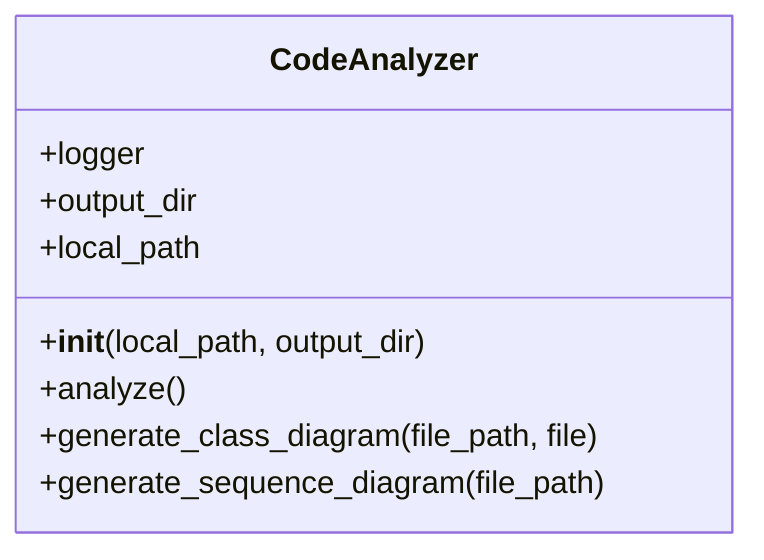

```mermaid
classDiagram
class CodeAnalyzer {
    +logger
    +output_dir
    +local_path
    +__init__(local_path, output_dir)
    +analyze()
    +generate_class_diagram(file_path, file)
    +generate_sequence_diagram(file_path)
}
```
