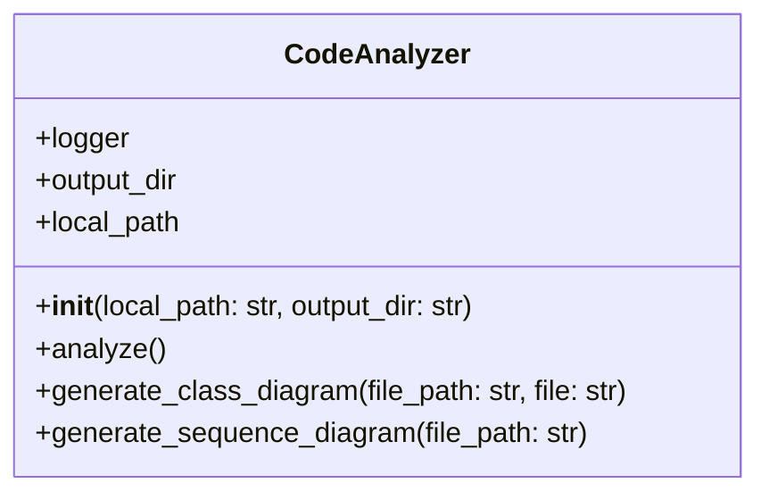

```mermaid
classDiagram
class CodeAnalyzer {
    +logger
    +output_dir
    +local_path
    +__init__(local_path: str, output_dir: str)
    +analyze()
    +generate_class_diagram(file_path: str, file: str)
    +generate_sequence_diagram(file_path: str)
}
```
