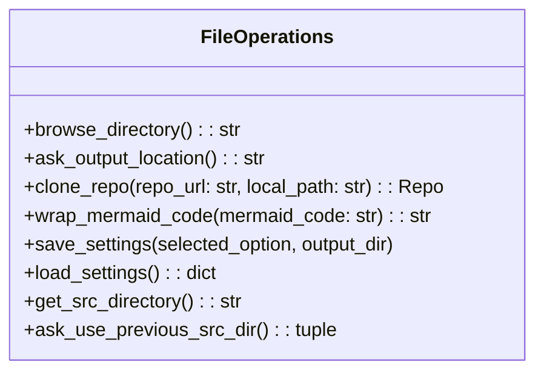

```mermaid
classDiagram
class FileOperations {
    +browse_directory() : str
    +ask_output_location() : str
    +clone_repo(repo_url: str, local_path: str) : Repo
    +wrap_mermaid_code(mermaid_code: str) : str
    +save_settings(selected_option, output_dir)
    +load_settings() : dict
    +get_src_directory() : str
    +ask_use_previous_src_dir() : tuple
}
```
