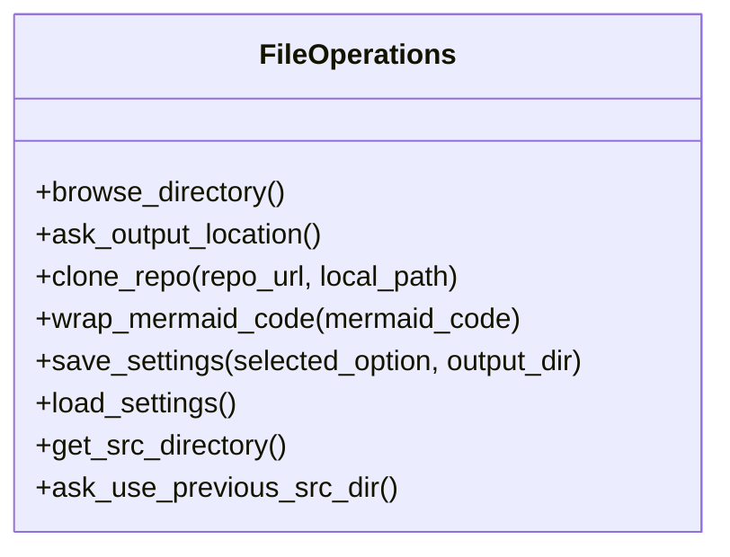

```mermaid
classDiagram
class FileOperations {
    +browse_directory()
    +ask_output_location()
    +clone_repo(repo_url, local_path)
    +wrap_mermaid_code(mermaid_code)
    +save_settings(selected_option, output_dir)
    +load_settings()
    +get_src_directory()
    +ask_use_previous_src_dir()
}
```
