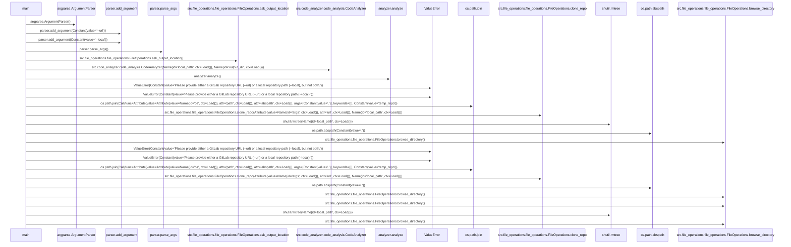

```mermaid
sequenceDiagram
    main ->>+ argparse.ArgumentParser: argparse.ArgumentParser()
    main ->>+ parser.add_argument: parser.add_argument(Constant(value='--url'))
    main ->>+ parser.add_argument: parser.add_argument(Constant(value='--local'))
    main ->>+ parser.parse_args: parser.parse_args()
    main ->>+ src.file_operations.file_operations.FileOperations.ask_output_location: src.file_operations.file_operations.FileOperations.ask_output_location()
    main ->>+ src.code_analyzer.code_analysis.CodeAnalyzer: src.code_analyzer.code_analysis.CodeAnalyzer(Name(id='local_path', ctx=Load()), Name(id='output_dir', ctx=Load()))
    main ->>+ analyzer.analyze: analyzer.analyze()
    main ->>+ ValueError: ValueError(Constant(value='Please provide either a GitLab repository URL (--url) or a local repository path (--local), but not both.'))
    main ->>+ ValueError: ValueError(Constant(value='Please provide either a GitLab repository URL (--url) or a local repository path (--local).'))
    main ->>+ os.path.join: os.path.join(Call(func=Attribute(value=Attribute(value=Name(id='os', ctx=Load()), attr='path', ctx=Load()), attr='abspath', ctx=Load()), args=[Constant(value='.')], keywords=[]), Constant(value='temp_repo'))
    main ->>+ src.file_operations.file_operations.FileOperations.clone_repo: src.file_operations.file_operations.FileOperations.clone_repo(Attribute(value=Name(id='args', ctx=Load()), attr='url', ctx=Load()), Name(id='local_path', ctx=Load()))
    main ->>+ shutil.rmtree: shutil.rmtree(Name(id='local_path', ctx=Load()))
    main ->>+ os.path.abspath: os.path.abspath(Constant(value='.'))
    main ->>+ src.file_operations.file_operations.FileOperations.browse_directory: src.file_operations.file_operations.FileOperations.browse_directory()
    main ->>+ ValueError: ValueError(Constant(value='Please provide either a GitLab repository URL (--url) or a local repository path (--local), but not both.'))
    main ->>+ ValueError: ValueError(Constant(value='Please provide either a GitLab repository URL (--url) or a local repository path (--local).'))
    main ->>+ os.path.join: os.path.join(Call(func=Attribute(value=Attribute(value=Name(id='os', ctx=Load()), attr='path', ctx=Load()), attr='abspath', ctx=Load()), args=[Constant(value='.')], keywords=[]), Constant(value='temp_repo'))
    main ->>+ src.file_operations.file_operations.FileOperations.clone_repo: src.file_operations.file_operations.FileOperations.clone_repo(Attribute(value=Name(id='args', ctx=Load()), attr='url', ctx=Load()), Name(id='local_path', ctx=Load()))
    main ->>+ os.path.abspath: os.path.abspath(Constant(value='.'))
    main ->>+ src.file_operations.file_operations.FileOperations.browse_directory: src.file_operations.file_operations.FileOperations.browse_directory()
    main ->>+ src.file_operations.file_operations.FileOperations.browse_directory: src.file_operations.file_operations.FileOperations.browse_directory()
    main ->>+ shutil.rmtree: shutil.rmtree(Name(id='local_path', ctx=Load()))
    main ->>+ src.file_operations.file_operations.FileOperations.browse_directory: src.file_operations.file_operations.FileOperations.browse_directory()
```
