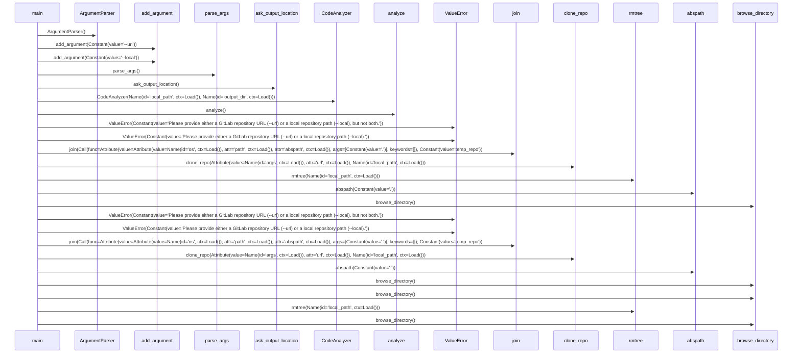

```mermaid
sequenceDiagram
    main ->>+ ArgumentParser: ArgumentParser()
    main ->>+ add_argument: add_argument(Constant(value='--url'))
    main ->>+ add_argument: add_argument(Constant(value='--local'))
    main ->>+ parse_args: parse_args()
    main ->>+ ask_output_location: ask_output_location()
    main ->>+ CodeAnalyzer: CodeAnalyzer(Name(id='local_path', ctx=Load()), Name(id='output_dir', ctx=Load()))
    main ->>+ analyze: analyze()
    main ->>+ ValueError: ValueError(Constant(value='Please provide either a GitLab repository URL (--url) or a local repository path (--local), but not both.'))
    main ->>+ ValueError: ValueError(Constant(value='Please provide either a GitLab repository URL (--url) or a local repository path (--local).'))
    main ->>+ join: join(Call(func=Attribute(value=Attribute(value=Name(id='os', ctx=Load()), attr='path', ctx=Load()), attr='abspath', ctx=Load()), args=[Constant(value='.')], keywords=[]), Constant(value='temp_repo'))
    main ->>+ clone_repo: clone_repo(Attribute(value=Name(id='args', ctx=Load()), attr='url', ctx=Load()), Name(id='local_path', ctx=Load()))
    main ->>+ rmtree: rmtree(Name(id='local_path', ctx=Load()))
    main ->>+ abspath: abspath(Constant(value='.'))
    main ->>+ browse_directory: browse_directory()
    main ->>+ ValueError: ValueError(Constant(value='Please provide either a GitLab repository URL (--url) or a local repository path (--local), but not both.'))
    main ->>+ ValueError: ValueError(Constant(value='Please provide either a GitLab repository URL (--url) or a local repository path (--local).'))
    main ->>+ join: join(Call(func=Attribute(value=Attribute(value=Name(id='os', ctx=Load()), attr='path', ctx=Load()), attr='abspath', ctx=Load()), args=[Constant(value='.')], keywords=[]), Constant(value='temp_repo'))
    main ->>+ clone_repo: clone_repo(Attribute(value=Name(id='args', ctx=Load()), attr='url', ctx=Load()), Name(id='local_path', ctx=Load()))
    main ->>+ abspath: abspath(Constant(value='.'))
    main ->>+ browse_directory: browse_directory()
    main ->>+ browse_directory: browse_directory()
    main ->>+ rmtree: rmtree(Name(id='local_path', ctx=Load()))
    main ->>+ browse_directory: browse_directory()
```
