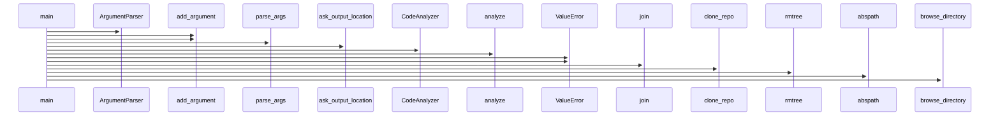

```mermaid
sequenceDiagram
    main ->>+ ArgumentParser: 
    main ->>+ add_argument: 
    main ->>+ add_argument: 
    main ->>+ parse_args: 
    main ->>+ ask_output_location: 
    main ->>+ CodeAnalyzer: 
    main ->>+ analyze: 
    main ->>+ ValueError: 
    main ->>+ ValueError: 
    main ->>+ join: 
    main ->>+ clone_repo: 
    main ->>+ rmtree: 
    main ->>+ abspath: 
    main ->>+ browse_directory: 
```
