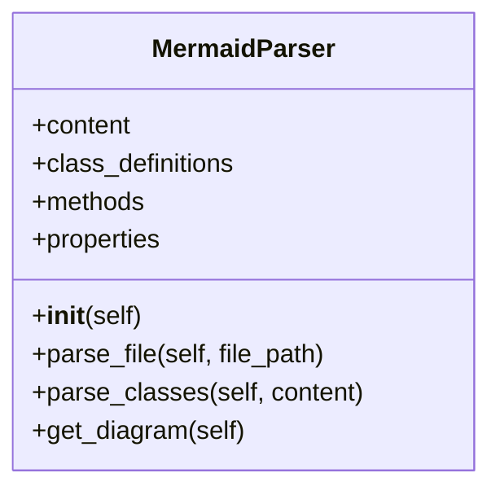

```mermaid
classDiagram
class MermaidParser {
    +__init__(self)
    +parse_file(self, file_path)
    +parse_classes(self, content)
    +get_diagram(self)
    +content
    +class_definitions
    +methods
    +properties
}
```
