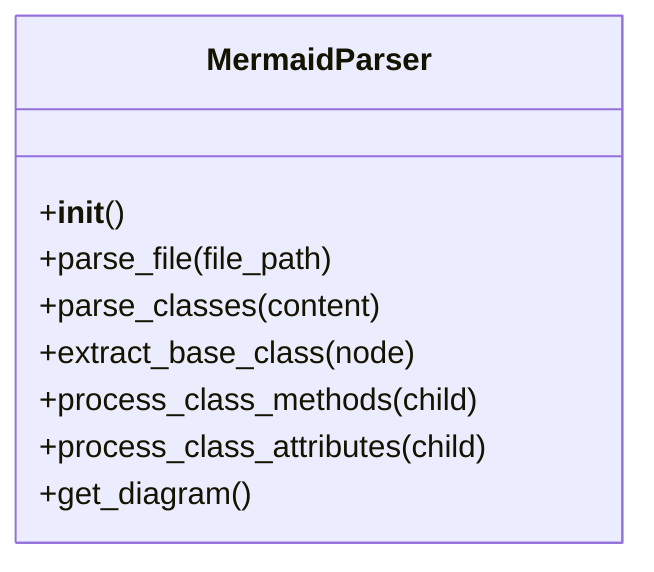

```mermaid
classDiagram
class MermaidParser {
    +__init__()
    +parse_file(file_path)
    +parse_classes(content)
    +extract_base_class(node)
    +process_class_methods(child)
    +process_class_attributes(child)
    +get_diagram()
}
```
