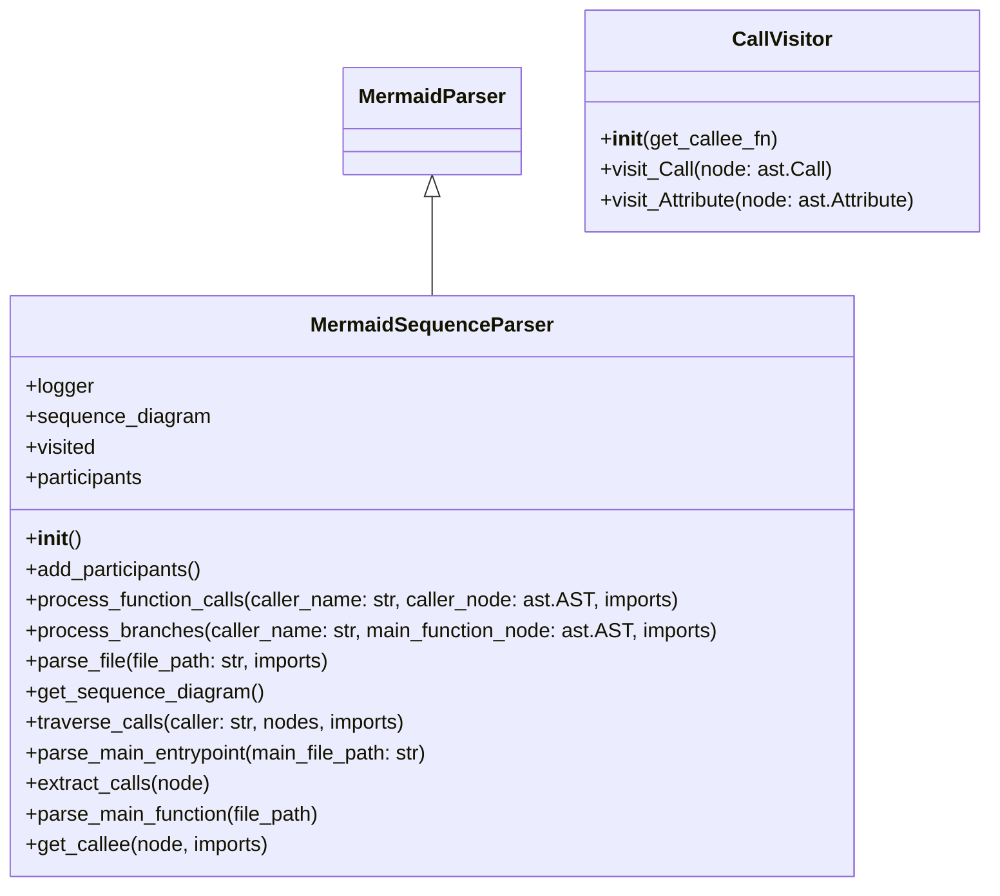

```mermaid
classDiagram
class MermaidSequenceParser {
    +logger
    +sequence_diagram
    +visited
    +participants
    +__init__()
    +add_participants()
    +process_function_calls(caller_name: str, caller_node: ast.AST, imports)
    +process_branches(caller_name: str, main_function_node: ast.AST, imports)
    +parse_file(file_path: str, imports)
    +get_sequence_diagram()
    +traverse_calls(caller: str, nodes, imports)
    +parse_main_entrypoint(main_file_path: str)
    +extract_calls(node)
    +parse_main_function(file_path)
    +get_callee(node, imports)
}
MermaidParser <|-- MermaidSequenceParser
class CallVisitor {
    +__init__(get_callee_fn)
    +visit_Call(node: ast.Call)
    +visit_Attribute(node: ast.Attribute)
}
```
